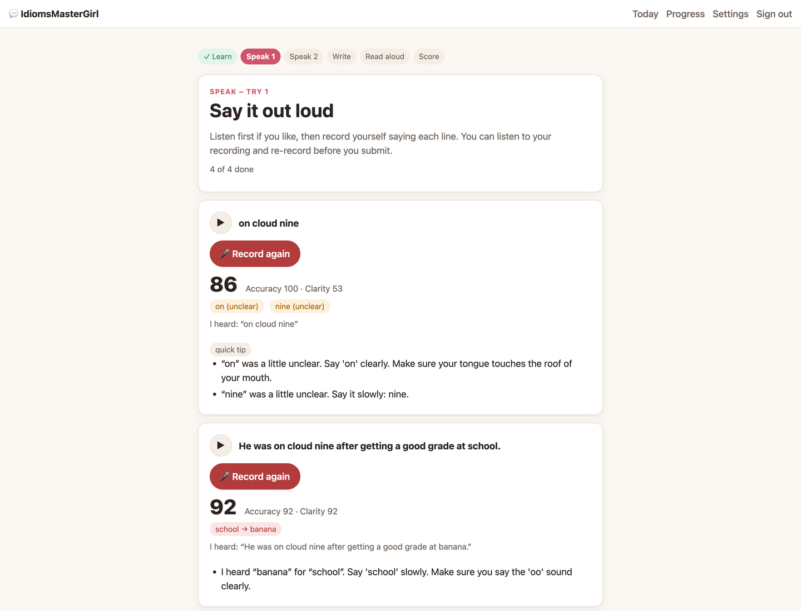
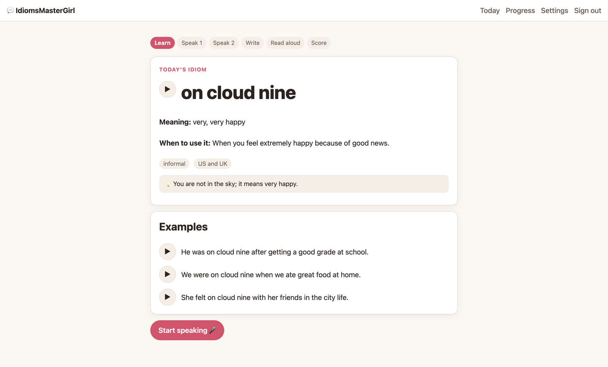
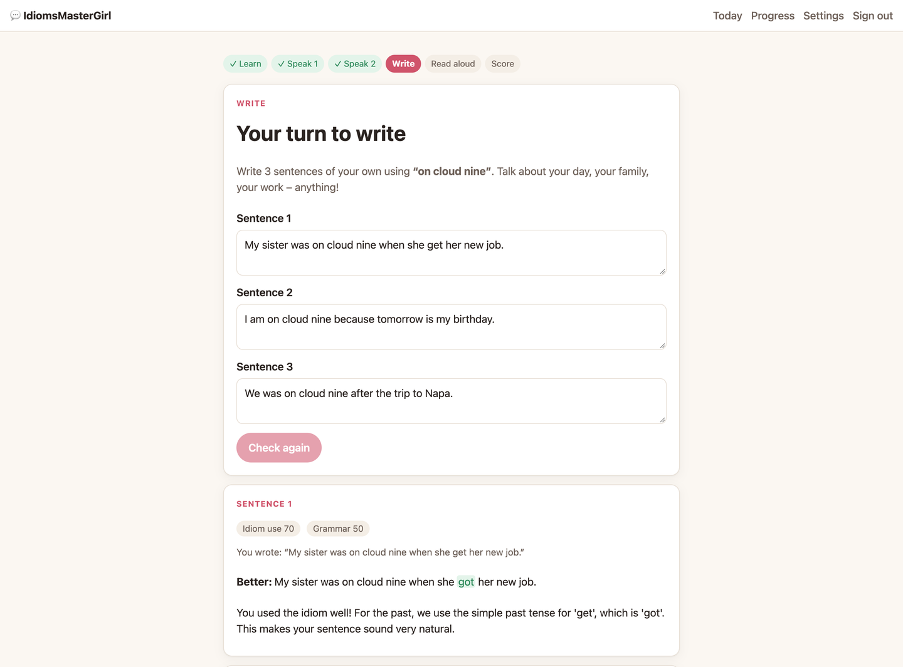
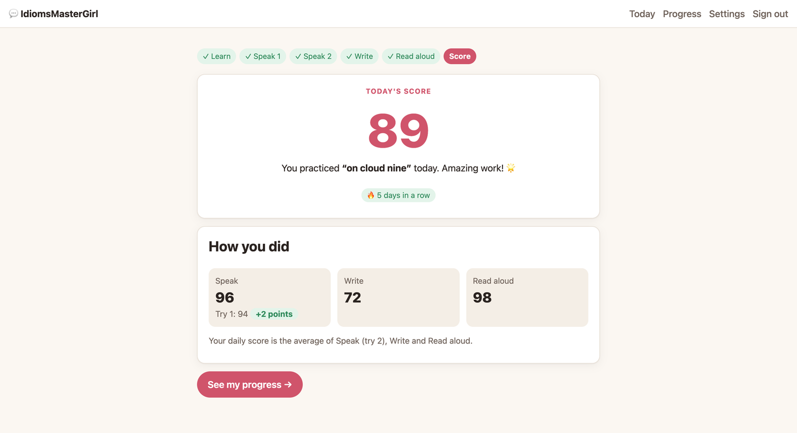
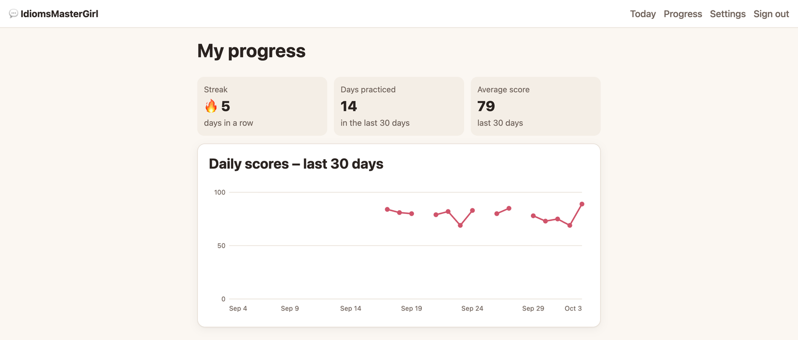

# IdiomsMasterGirl 💬

**One English idiom a day: learn it, hear it, say it, write it, and read it aloud.** A
local-first practice partner for an A2 English learner. It listens to her speak, tells her
kindly which exact words to fix, and corrects her own sentences. The AI runs on the laptop,
so her voice and mistakes stay private.




## Table of Contents

- [Why this exists](#why-this-exists)
- [How it works](#how-it-works)
- [Installation](#installation)
- [Quick start](#quick-start)
- [Configuration](#configuration)
- [API reference](#api-reference)
- [Project structure](#project-structure)
- [Tests](#tests)
- [Contributing](#contributing)
- [Roadmap](#roadmap)
- [What I learned](#what-i-learned)
- [Open models, privacy and why open matters](#open-models-privacy-and-why-open-matters)
- [Known limitations](#known-limitations)
- [License](#license)
- [Credits](#credits)
- [Screenshots](#screenshots)
- [Author](#author)

---

## Why this exists

I built this for **Eugenia**, my wife. She is learning English in San Francisco at an A2
(elementary) level. Idioms are everywhere in American life ("it's a piece of cake", "let's call
it a day"), and they are hard to learn from a textbook.

General apps don't fit her well. Flashcard apps never hear her speak. Chatbots invent
idioms, correct too much or too little, and send her recordings to a server. She needed a
**patient partner pitched at her level** that:

- picks **one common idiom a day**,
- lets her **hear** it in a natural American voice,
- **listens** and names the exact word that came out wrong,
- **corrects her own sentences** with a short reason why, and
- shows **progress and a streak** so she keeps coming back.

## How it works

A daily session takes about 15–20 minutes (measured with Eugenia: under 20 minutes).

| Step | What happens |
|------|--------------|
| 1. **Learn** | Today's idiom with its meaning, a "when to use it" note, register/region, a literal-vs-figurative note and 3 examples. Every line has a ▶ play button. |
| 2. **Speak, try 1** | She records the idiom and the 3 examples. Each recording gets **accuracy**, **clarity** and a **combined score**, plus 1–3 warm tips that name the exact words: *"I heard “cape” for “cake”. End with a strong K sound."* |
| 3. **Speak, try 2** | She records everything again and sees **+N points** per sentence and overall. |
| 4. **Write** | She writes 3 sentences of her own. Each gets an idiom-use grade, a grammar grade, a corrected version with the changes highlighted, and a short explanation. |
| 5. **Read aloud** | She hears her corrected sentences, then reads them aloud and gets scored. |
| 6. **Score** | The daily score (average of Speak try 2, Write and Read aloud), a 30-day chart and her 🔥 streak. |

She can leave mid-session and come back to the same step later that day.

### Scoring

- **Accuracy** = `100 × (1 − word error rate)` of the transcript against the target sentence.
  Case, punctuation and contractions ("it's" = "it is") are ignored.
- **Clarity** = the average confidence Whisper gives to each word she said.
- **Combined** = `70% accuracy + 30% clarity`.
- **Problem words** are words that were missing, replaced, or recognized with confidence
  below 0.6.
- **Tips**: the code writes the fact ("I heard X for Y"), and the local model writes the
  coaching hint. Every tip therefore names a real word, and nothing is invented. A clean
  recording gets praise, not fake corrections.

### Architecture

```text
Chrome (localhost:3000)
  │  MediaRecorder (webm/opus) · speechSynthesis fallback (on-device voices only)
  ▼
Next.js 16 route handlers (Node runtime)
  ├── lib/scoring   word alignment (WER), clarity, problem words: pure TypeScript
  ├── lib/tutor ──► Ollama :11434  gemma4:e2b, JSON-schema output, validated in code
  ├── lib/stt ────► Python sidecar :8765  FastAPI + faster-whisper small.en (per-word confidence)
  ├── lib/tts ────► ElevenLabs (opt-in, text only) → cached in data/audio/
  └── lib/db ─────► SQLite data/app.db via built-in node:sqlite
```

---

## Installation

### Prerequisites

| Tool | Version | Notes |
|------|---------|-------|
| macOS | Apple Silicon recommended | Built and measured on an M4 with 24 GB RAM |
| [Node.js](https://nodejs.org) | **≥ 26** | `.nvmrc` included; `node:sqlite` is built in |
| [uv](https://docs.astral.sh/uv/) | recent | Installs Python 3.12 for the speech helper |
| [Ollama](https://ollama.com) | **≥ 0.30.9** | Must be running |
| Chrome | current | Needed for microphone recording |
| ffmpeg | **not needed** | PyAV ships its own decoders |

### Steps

```bash
git clone https://github.com/gusanchefullstack/idioms-master-girl.git
cd idioms-master-girl
nvm use                       # Node 26
npm install
cp .env.example .env.local    # optional: add ELEVENLABS_API_KEY=... for the natural voice
npm run setup
```

`npm run setup` is safe to run again. It:

1. checks your Node version;
2. pulls `gemma4:e2b` into Ollama if it is missing;
3. installs the speech helper (`uv sync`) and downloads Whisper `small.en` once;
4. creates `data/app.db`;
5. asks for the learner's name, username, email and password;
6. asks whether to use the natural ElevenLabs voice (default: **No**).

## Quick start

```bash
npm run dev
```

This starts three processes:

```text
[stt]  Uvicorn running on http://127.0.0.1:8765      ← local speech recognition
[web]  ▲ Next.js 16 – Local: http://127.0.0.1:3000  ← the app
[warm] Tutor model gemma4:e2b is warm (259 ms).     ← loads Gemma so the first session is fast
```

Open **http://localhost:3000** in Chrome, sign in with the username or email from setup,
allow the microphone, and press **Start speaking 🎤** after reading today's idiom.

Check that everything is up:

```bash
curl -s localhost:3000/api/health
# {"ollama":"up","model":"gemma4:e2b","stt":"up","externalVoice":"off"}
```

Score any audio file exactly the way the app does:

```bash
npm run score:file -- stt/tests/fixtures/clip.webm "Finishing the homework was a piece of cake for me."
# { "transcript": "Finishing the homework was a piece of cake for me.", "accuracy": 100, "clarity": 98, "combined": 99, "problemWords": [] }
```

## Configuration

### Environment variables

| Variable | Description | Required | Default |
|----------|-------------|----------|---------|
| `ELEVENLABS_API_KEY` | Enables the natural American voice. Put it in `.env.local`. It needs **text-to-speech** permission only. | No | — (uses the Mac's own voice) |
| `IDIOMS_DB` | Path to the SQLite file. Handy for a throwaway test account. | No | `data/app.db` |
| `STT_MODEL` | Whisper model for the speech helper (set by `npm run dev`) | No | `small.en` |
| `HF_HUB_OFFLINE` | Keeps the speech helper from reaching the internet (set by `npm run dev`) | No | `1` |

### `config/settings.json`

This file is read on every request, so changes apply without a restart or code changes.

| Key | What it controls | Default |
|-----|------------------|---------|
| `llm.model` / `llm.baseUrl` | Tutor model and Ollama endpoint, swappable to any Ollama model with JSON-schema output | `gemma4:e2b` / `http://127.0.0.1:11434` |
| `stt.model` | Whisper size (`base.en` is faster) | `small.en` |
| `stt.minSpeechSeconds` | Shorter recordings are kindly rejected | `0.5` |
| `scoring.accuracyWeight` / `clarityWeight` | Combined score weights (must add up to 1) | `0.7` / `0.3` |
| `scoring.lowConfidenceThreshold` | Below this, a word is marked "unclear" | `0.6` |
| `session.noRepeatDays` | Days before an idiom can come back | `60` |
| `tutor.personality` | The tutor's voice in every prompt | "warm, patient, playful big-sister tutor…" |
| `voice.external.voiceId` / `modelId` | ElevenLabs voice and model | Rachel / `eleven_flash_v2_5` |

The prompts are plain Markdown files in [`prompts/`](prompts/). The 100 curated idioms are in
[`content/idioms.json`](content/idioms.json). The learner's level, difficulty range and voice
switch are set on the **Settings** page.

## API reference

All routes are Next.js route handlers on `127.0.0.1:3000/api`. Everything except
`auth/login` and `health` needs the `session` cookie. Full contracts are in
[`specs/001-idioms-daily-practice/contracts/`](specs/001-idioms-daily-practice/contracts/).

| Method | Route | Purpose |
|--------|-------|---------|
| `POST` | `/auth/login` · `/auth/logout` | Sign in with username or email, or sign out |
| `GET` | `/session/today` | Today's session with the curated idiom, returned at once |
| `POST` | `/session/{id}/examples` | Generate and store the 3 examples (idempotent) |
| `POST` | `/session/{id}/step` | Move one step forward (guarded) |
| `POST` | `/attempts` | Score one recording (multipart: `itemId`, `phase`, `audio`) |
| `POST` | `/sentences` · `/sentences/{id}/regrade` | Grade her 3 sentences, or retry one |
| `GET` | `/audio?itemId=` | Saved or new ElevenLabs clip, or `204` + `X-Voice-Fallback: local` |
| `GET` | `/progress?days=30` | Streak, 30-day series, today's parts |
| `GET`/`PATCH` | `/settings` | Profile and natural-voice switch |
| `GET` | `/health` | Status of Ollama, the speech helper and the voice |

### `POST /api/attempts`

```bash
curl -b cookies.txt -F itemId=41 -F phase=try1 -F audio=@take.webm localhost:3000/api/attempts
```

```json
{
  "id": 301, "itemId": 41, "phase": "try1",
  "accuracy": 92, "clarity": 92, "combined": 92,
  "transcript": "He was on cloud nine after getting a good grade at banana.",
  "problemWords": [{ "word": "school", "type": "substituted", "heard": "banana" }],
  "tips": ["I heard “banana” for “school”. Say 'school' slowly. Make sure you say the 'oo' sound clearly."],
  "feedbackSource": "llm"
}
```

A silent or too-short take returns `422`:
`{"error":"recording_rejected","reason":"no_speech","message":"I couldn't hear any words – please check your microphone and try again."}`

## Project structure

```text
app/            Next.js pages (login, session, progress, settings) and API routes
components/     Learn / Speak / Write / Read aloud / Summary steps, Recorder, PlayButton, ProgressChart
lib/            db (node:sqlite), auth, idioms, scoring/, tutor/ (Ollama, examples, tips, grading), stt, tts, progress
content/        idioms.json – 100 curated A2–B1 idioms
prompts/        the tutor's prompts (Markdown)
config/         settings.json – model, thresholds, weights, voice
stt/            the local speech helper (Python, FastAPI + faster-whisper) and its smoke tests
scripts/        setup, warm-up, score-file, seed-days (dev)
tests/          unit/ (Vitest) and tutor/ (live model quality checks)
specs/          Spec Kit spec, plan, research, data model, contracts and tasks
assets/         README screenshots
```

## Tests

The project uses **Vitest** for TypeScript and **pytest** for the speech helper.

```bash
npm test                      # 55 unit tests: scoring, idiom list, step rules, streak, tips, grading
uv run --project stt pytest   # speech helper smoke test, offline (includes repeatability)
npm run test:tutor            # live model quality check (Ollama must be running)
npm run typecheck             # tsc --noEmit
```

The latest `test:tutor` run:

- **Tips (SC-005):** 20/20 named a real problem word, and none were discouraging.
- **Corrections (SC-006):** 13 of 15 known errors were fixed.

## Contributing

Contributions are welcome, especially if you are building one for someone you know.

1. Fork the repo and create a branch: `feat/<short-name>` or `fix/<short-name>`.
2. Follow the Spec Kit flow for anything bigger than a fix: update `specs/` (spec → plan →
   tasks) before coding.
3. Keep tutor text in `prompts/` and tunable numbers in `config/settings.json`, never
   hard-coded.
4. Use [Conventional Commits](https://www.conventionalcommits.org/) (`feat:`, `fix:`,
   `chore:`, `docs:`).
5. Run `npm test`, `uv run --project stt pytest` and `npm run typecheck`, then open a PR
   that explains *why*.

Never commit `.env.local` or `data/`, and never send recordings anywhere except the local
speech helper.

## Roadmap

- [x] Daily idiom from a curated list, with a 60-day no-repeat window
- [x] Speak twice with word-level scores and tips that name the words
- [x] Write three sentences and get grades and corrections
- [x] Read corrected sentences aloud
- [x] Daily score, 30-day chart and streak
- [x] Natural voice (opt-in) with a cache and an on-device fallback
- [ ] Full offline run verified with Wi-Fi turned off (constitution check before submission)
- [ ] Local open text-to-speech (e.g. Piper or Kokoro), so the voice is open too
- [ ] Short explanations in her native language when an English one is too hard
- [ ] Use the phone as a microphone over HTTPS on the home network
- [ ] Review mode that brings back idioms she found hardest

## What I learned

**Architecture**
- Moving **facts into code and leaving coaching to the model** fixed tip quality. A 4.6B
  model wrote vague, idiom-heavy tips that rarely named the word: 0 of 4 in my first test.
  When the code writes "I heard X for Y" and the model writes only the hint, 20 of 20 tips
  name the right word.
- **Validate structured output, then coerce, then retry once.** Ollama's
  [JSON-schema `format`](https://github.com/ollama/ollama/blob/main/docs/api.md) guarantees
  the shape, not the meaning. A small model can say `isCorrect: true` and still change the
  sentence, so the code fixes contradictions before deciding to retry.
- **Two requests for one screen.** The curated idiom shows at once, and the examples load in
  a second call. That keeps first paint fast even when the model is cold (about 13 s).

**Stack**
- [faster-whisper](https://github.com/SYSTRAN/faster-whisper) gives **per-word
  probabilities**. Those are the basis of the clarity score and the "unclear word" check.
  `temperature=0.0` plus `condition_on_previous_text=False` makes scores repeatable.
- [`node:sqlite`](https://nodejs.org/api/sqlite.html) (built into Node 26) worked inside
  Next.js route handlers with no native addon and no config.
- Next 16 renamed `middleware.ts` to
  [`proxy.ts`](https://nextjs.org/docs/app/api-reference/file-conventions/proxy).
- Chrome's "Google US English" voices **go over the network**. A truly local fallback filters
  to `voice.localService === true`.

**Errors solved**

| Error | Cause | Fix |
|-------|-------|-----|
| `open() got an unexpected keyword argument 'metadata_errors'` | faster-whisper 1.2 with PyAV 19 | Pin `av<17` |
| `npm run dev` stopped all servers after a few seconds | `concurrently -k` kills everything when *any* process exits, including the warm-up script | `--kill-others-on-fail` |
| A mocked tutor was called with `undefined` after each test | `beforeEach(() => mock.mockReset())` returns the mock, and Vitest runs a returned function as cleanup | Use a block body `{ … }` |
| ElevenLabs `401 missing_permissions` on `/v1/voices` | A key limited to text-to-speech | Don't call voices or user endpoints; set the voice id in config |
| `gemma4:e2b-mlx` used idioms literally ("this cake is a piece of cake") | Variant quality | Default to `gemma4:e2b` |
| Second `next dev` in the same folder refused to start | Next 16 allows one dev server per project | Stop the first one, or point `IDIOMS_DB` at a test DB |

## Open models, privacy and why open matters

| Piece | What | License | Runs |
|-------|------|---------|------|
| Tutor | **Gemma 4 E2B** (`gemma4:e2b`, 4.6B params, Q4_K_M) | Apache 2.0 | locally via **Ollama** (MIT) |
| Ears | **Whisper `small.en`** | MIT | locally via **faster-whisper** (MIT) + CTranslate2 (MIT), CPU int8 |
| Idioms | 100 curated A2–B1 idioms | MIT (this repo) | local file |
| Voice (optional) | ElevenLabs text-to-speech | proprietary API | cloud, opt-in, text only |

**Privacy**
- Her **recordings never leave the laptop**. They go to the speech helper on `127.0.0.1`,
  are processed in memory, and are never saved.
- Scores, sentences and history live in `data/app.db` on this laptop. There is no telemetry,
  analytics or remote logging.
- The natural voice is **opt-in**. When it is on, only the sentence being spoken is sent, and
  each sentence is sent only once: the audio is cached in `data/audio/`. When it is off or the
  internet is down, the Mac's own voice reads instead.

**Why open innovation matters here**
- **It works offline.** After setup, the whole lesson works with Wi-Fi off.
- **Her mistakes stay private.** A learner's recordings and wrong sentences are personal.
- **It is tuned to one person.** The model, prompts and idiom list are all ours, so the tutor
  speaks to *her* level and in *her* tone. Changing that is editing a text file.
- **It costs nothing.** No API bill per session.
- **Where open beat closed:** the scoring needs per-word confidence and repeatable results.
  Open Whisper gives both directly, while closed speech APIs usually hide or change them.

## Known limitations

- Whisper sometimes "autocorrects" a mispronounced word into the right one, so accuracy can
  be a bit generous. The clarity score and the low-confidence check catch most of these.
- The small default model fixed 13 of 15 known grammar errors in our check, and it sometimes
  misses a past-tense error after "yesterday". `gemma4:26b` is a one-line swap.
- If Ollama is cold, the first examples of the day can take about 13 s. `npm run dev` warms it.
- The microphone works on `localhost` only, because browsers require a secure origin.
- Chrome is the supported browser (MediaRecorder with webm/opus).

## License

Distributed under the [MIT License](LICENSE) © 2026 Gustavo Sanchez Galarza. You are welcome
to fork it and build one for someone you care about.

The MIT license covers this repository: the code, prompts and curated idiom list. The models
and services the app uses keep their own terms: Gemma 4 (Apache 2.0), Whisper (MIT), Ollama
(MIT), faster-whisper (MIT), and the ElevenLabs API (ElevenLabs' terms of service, only if
you turn it on).

## Credits

- [Ollama](https://ollama.com) and Google's [Gemma](https://ai.google.dev/gemma) for the
  local tutor
- [OpenAI Whisper](https://github.com/openai/whisper) and
  [faster-whisper](https://github.com/SYSTRAN/faster-whisper) by SYSTRAN for local speech
  recognition
- [ElevenLabs](https://elevenlabs.io) for the optional natural voice
- [Next.js](https://nextjs.org), [FastAPI](https://fastapi.tiangolo.com),
  [Vitest](https://vitest.dev) and [uv](https://docs.astral.sh/uv/)
- [GitHub Spec Kit](https://github.com/github/spec-kit) for the spec-driven workflow, and
  [Claude Code](https://claude.com/claude-code) as the pair programmer
- Built for Hacktoberfest 2026, Week 1: *Build for a Friend*. Above all, thanks to
  **Eugenia**, the one real user, for testing it every day.

## Screenshots

**1. Learn:** today's idiom, its meaning and notes, and 3 examples, each with a ▶ play
button.



**2. Speak:** a score per recording, the words to practice, and tips that name them.


**3. Write:** grades, a corrected sentence with the change highlighted, and why.



**4. Score:** the daily score, each part, and the improvement from try 1 to try 2.



**5. Progress:** the streak, days practiced, average score and a 30-day chart.



*Screenshots use a demo account with seeded history. The recordings were synthesized with
the macOS `say` voice.*

## Author

**Gustavo Sanchez Galarza**, software engineer in San Francisco ·
[gustavosanchez.dev](https://www.gustavosanchez.dev) · hello@gustavosanchez.dev

[](https://www.linkedin.com/in/gustavosanchezgalarza/)
[](https://github.com/gusanchefullstack)
[](https://hashnode.com/@gusanchedev)
[](https://x.com/gusanchedev)
[](https://bsky.app/profile/gusanchedev.bsky.social)
[](https://www.frontendmentor.io/profile/gusanchefullstack)
[](https://frontendmasters.com/u/gustavosanchezdev/)
[](https://www.gustavosanchez.dev)
